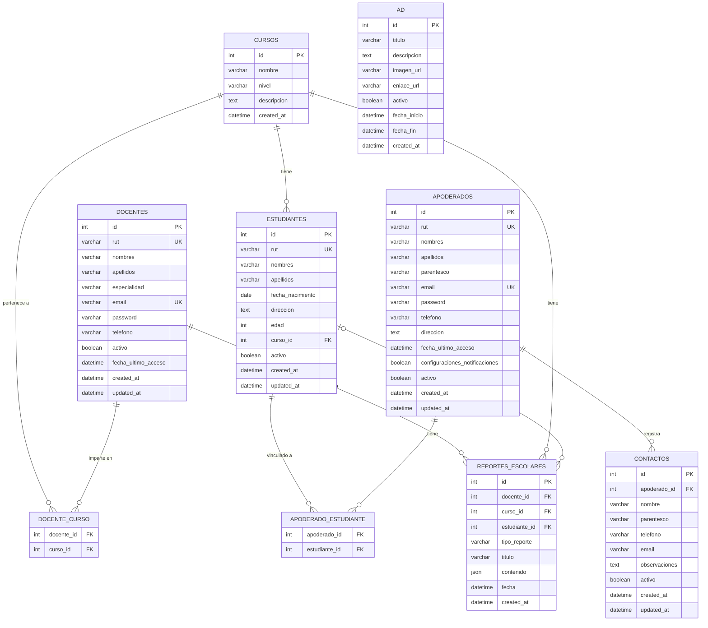

# Agenda Digital Escolar

**Ecosistema de comunicación bidireccional entre establecimiento educativo y apoderados**

Una aplicación web robusta y escalable desarrollada con Node.js, Express y MySQL (Sequelize ORM), que garantiza la integridad y disponibilidad de la información escolar en tiempo real.

## Descripción Funcional

La solución implementa una plataforma de comunicación que opera bajo un modelo de estados que asegura la trazabilidad de cada comunicación entre docentes y apoderados.

### Flujos de Operación Principal

#### A. Gestión del Docente (Emisión)
El flujo inicia con la autenticación del docente, quien accede a un panel centralizado para seleccionar el curso y tipo de reporte:
- **Asistencia Diaria**: Registro de presentes, ausentes y atrasados
- **Aviso Diario**: Comunicaciones generales del día escolar  
- **Reporte de Salud**: Información médica y de salud de estudiantes

El sistema valida la integridad de los datos en el cliente antes de enviarlos a la API en Node.js, donde se procesan y persisten en la base de datos relacional MySQL.

#### B. Notificación y Recepción (Apoderado)
Una vez almacenado el dato, la plataforma actualiza el muro de noticias del apoderado de forma reactiva. El flujo contempla un mecanismo de "Confirmación de Lectura", donde el apoderado interactúa con el sistema para cerrar el ciclo de comunicación.

## Arquitectura y Componentes

### Capa de Presentación (Frontend)
- **Tecnología**: React.js
- **Características**: Componentes dinámicos adaptables a dispositivos móviles y de escritorio
- **UX**: Interfaz fluida para registro de datos y lectura de avisos

### Capa de Servicio (Backend)  
- **Tecnología**: Node.js + Express.js
- **Función**: API REST con gestión de seguridad mediante tokens
- **Reglas de Negocio**: Validación de permisos por curso (solo profesor jefe puede publicar)

### Capa de Datos (Persistencia)
- **Tecnología**: MySQL + Sequelize ORM
- **Formato**: Tablas relacionales con integridad referencial
- **Ventaja**: Consistencia transaccional y consultas relacionales eficientes

## Instalación

```bash
# Clonar o descargar el proyecto
cd agenda

# Instalar dependencias
npm install

# Configurar variables de entorno
cp .env.example .env
```

## Uso

### Desarrollo
```bash
npm run dev
```

### Producción  
```bash
npm start
```

### Versión de desarrollo
```bash
npm run dev
```

El servidor se ejecutará en `http://localhost:8080`

## API Endpoints del Sistema Escolar

### Gestión del Docente
| Método | Endpoint | Descripción |
|--------|----------|-------------|
| POST | `/api/docentes/login` | Autenticación del docente |
| GET | `/api/docentes/perfil` | Perfil del docente autenticado |
| GET | `/api/docentes/:id/cursos` | Cursos asignados al docente |
| POST | `/api/docentes/reportes` | Crear reporte escolar |
| GET | `/api/docentes/reportes` | Historial de reportes del docente |
| GET | `/api/docentes/cursos/:cursoId/estudiantes` | Estudiantes de un curso |

### Notificación y Recepción  
| Método | Endpoint | Descripción |
|--------|----------|-------------|
| POST | `/api/apoderados/login` | Autenticación del apoderado |
| GET | `/api/apoderados/muro` | Muro de noticias reactivo |
| POST | `/api/apoderados/confirmar-lectura` | Confirmar lectura de un reporte |
| GET | `/api/apoderados/hijos` | Lista de hijos del apoderado |
| GET | `/api/apoderados/reportes/:estudianteId` | Reportes de un estudiante específico |

### Gestión de Reportes
| Método | Endpoint | Descripción |
|--------|----------|-------------|
| GET | `/api/reportes/tipos` | Tipos de reportes disponibles |
| POST | `/api/reportes/asistencia` | Crear reporte de asistencia |
| POST | `/api/reportes/aviso-diario` | Crear aviso diario |
| POST | `/api/reportes/salud` | Crear reporte de salud |
| GET | `/api/reportes/curso/:cursoId` | Reportes de un curso (con filtros) |
| GET | `/api/reportes/estadisticas` | Estadísticas de reportes por tipo |

### Gestión de Estudiantes
| Método | Endpoint | Descripción |
|--------|----------|-------------|
| GET | `/api/estudiantes` | Listar todos los estudiantes (filtros: cursoId, activo) |
| POST | `/api/estudiantes` | Crear un nuevo estudiante |
| GET | `/api/estudiantes/:id` | Obtener estudiante por ID (incluye curso y apoderados) |
| PUT | `/api/estudiantes/:id` | Actualizar datos del estudiante |
| DELETE | `/api/estudiantes/:id` | Desactivar estudiante (soft delete) |
| GET | `/api/estudiantes/:id/apoderados` | Listar apoderados vinculados al estudiante |

### Contactos de Emergencia
| Método | Endpoint | Descripción |
|--------|----------|-------------|
| GET | `/api/contactos` | Listar todos los contactos activos |
| POST | `/api/contactos` | Crear contacto de emergencia |
| GET | `/api/contactos/:id` | Obtener contacto por ID |
| PUT | `/api/contactos/:id` | Actualizar contacto |
| DELETE | `/api/contactos/:id` | Desactivar contacto (soft delete) |

### Sistema
| Método | Endpoint | Descripción |
|--------|----------|-------------|
| GET | `/` | Información general de la API |
| GET | `/api/health` | Estado de la API y de la base de datos |

## Integración y Conectividad

La integración de componentes se realiza mediante protocolo **HTTP/HTTPS** utilizando la librería Axios. Los flujos de datos son **bidireccionales**:

- **Cliente → Servidor**: Envío de datos de reportes
- **Servidor → Cliente**: Entrega de datos de consulta  
- **Sincronización**: Agenda siempre actualizada con base de datos centralizada

## Estructura del Proyecto

```
agenda-api/
├── app.js                          # Servidor principal
├── swagger.js                      # Definición OpenAPI (schemas y componentes)
├── setup.js                        # Script de inicialización
├── package.json                    # Dependencias del proyecto
├── .env                           # Variables de entorno
├── .nvmrc                         # Versión de Node.js requerida (24)
├── README.md                      # Este archivo
├── routes/                        # Rutas de la API (con docs Swagger JSDoc)
│   ├── docentes.js
│   ├── apoderados.js
│   ├── contactos.js
│   ├── reportes.js
│   └── estudiantes.js
├── controllers/                   # Lógica de negocio
│   ├── docentesController.js
│   ├── apoderadosController.js
│   ├── contactosController.js
│   ├── reportesController.js
│   └── estudiantesController.js
├── models/                        # Modelos Sequelize
│   ├── Docente.js
│   ├── Apoderado.js
│   ├── Estudiante.js
│   ├── Curso.js
│   ├── ReporteEscolar.js
│   ├── Contacto.js
│   ├── DocEnteCurso.js            # Tabla intermedia docente ↔ curso
│   ├── ApoderadoEstudiante.js     # Tabla intermedia apoderado ↔ estudiante
│   ├── Ad.js
│   └── index.js
├── database/                      # Conexión y utilidades de BD
│   ├── connection.js
│   ├── inicializarDatos.js
│   └── create-tables.js
└── tests/                         # Suite de pruebas
    ├── run-all.js
    ├── unit/
    │   ├── docente.test.js
    │   ├── apoderado.test.js
    │   ├── estudiante.test.js
    │   ├── run-all-unit.js
    │   ├── docente/
    │   ├── apoderado/
    │   └── estudiante/
    ├── integration/
    ├── database/
    └── scripts/
```

## Esquema de Base de Datos

### Diagrama Entidad-Relación



### Relaciones del Modelo

| Relación | Tipo | Tabla intermedia |
|----------|------|-----------------|
| Docente ↔ Curso | N:M | `docente_curso` |
| Apoderado ↔ Estudiante | N:M | `apoderado_estudiante` |
| Curso → Estudiante | 1:N | — |
| Apoderado → Contacto | 1:N | — |
| Docente → ReporteEscolar | 1:N | — |
| Curso → ReporteEscolar | 1:N | — |
| Estudiante → ReporteEscolar | 1:N (opcional) | — |

## Pruebas del Sistema

### Ejecutar Pruebas Completas
```bash
npm test
```

### Ejecutar Pruebas Unitarias
```bash
npm run test:unit
```

### Casos de Prueba Incluidos
- ✅ Autenticación de docentes y apoderados
- ✅ Creación de reportes con validación de integridad  
- ✅ Actualización reactiva del muro de noticias
- ✅ Confirmación de lectura y cierre del ciclo
- ✅ Trazabilidad completa de comunicaciones
- ✅ Estadísticas de efectividad comunicacional

## Características Técnicas Implementadas

### Modelo de Estados
- **Creación**: Docente crea reporte con validaciones
- **Notificación**: Sistema actualiza muro automáticamente  
- **Confirmación**: Apoderado confirma lectura
- **Trazabilidad**: Registro completo de la comunicación

### Validación de Integridad
- **Cliente**: Validación de campos requeridos
- **Servidor**: Aplicación de reglas de negocio
- **Base de Datos**: Consistencia de datos garantizada

### Reglas de Negocio
- Solo profesores jefe pueden crear reportes en sus cursos
- Reportes de salud tienen prioridad urgente  
- Confirmaciones de lectura son obligatorias para ciertos tipos
- Trazabilidad completa de todas las comunicaciones

## Documentación Interactiva (Swagger)

Accede a la documentación completa con Swagger UI en: `http://localhost:8080/api-docs`

Especificación OpenAPI en JSON: `http://localhost:8080/api-docs.json`

Estado del sistema: `http://localhost:8080/api/health`

## Stack Tecnológico

- **Node.js** (v24) - Entorno de ejecución de JavaScript
- **Express.js** - Framework web para Node.js
- **MySQL** - Base de datos relacional
- **Sequelize ORM** - Mapeo objeto-relacional para MySQL

### Dependencias Principales
- Express.js - Framework web
- Sequelize + mysql2 - ORM y driver MySQL
- bcrypt - Hash de contraseñas
- CORS - Middleware para cross-origin requests
- Body-parser - Parseo de cuerpos de petición
- Dotenv - Gestión de variables de entorno
- swagger-jsdoc + swagger-ui-express - Documentación interactiva
- Nodemon - Desarrollo con recarga automática

## Próximos Pasos para Producción

- [ ] **Autenticación JWT**: Implementar tokens seguros
- [ ] **Frontend React**: Desarrollar interfaz de usuario
- [ ] **WebSockets**: Notificaciones en tiempo real
- [ ] **Notificaciones Push**: Alertas móviles
- [ ] **Dashboard Analytics**: Métricas de uso
- [ ] **Tests Automatizados**: Cobertura completa
- [ ] **Docker**: Containerización para deployment

## Indicadores de Evaluación

### ✅ Indicador 2 - Integración
La integración real de componentes mediante protocolo HTTP/HTTPS está implementada y verificada con:
- Comunicación bidireccional funcional
- Validación de datos en cliente y servidor  
- Persistencia simulada con estructuras JSON
- Flujos completos de emisión y recepción
- Trazabilidad de estados documentada

## Licencia

Este proyecto está bajo la Licencia ISC - ver el archivo LICENSE para detalles.

---

**Desarrollado para el Instituto AIEP - Carrera de Analista Programador**  
*Proyecto: Agenda Digital Escolar - Node.js + Express + MySQL*
